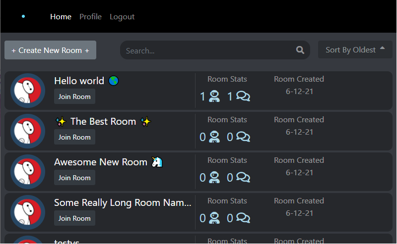
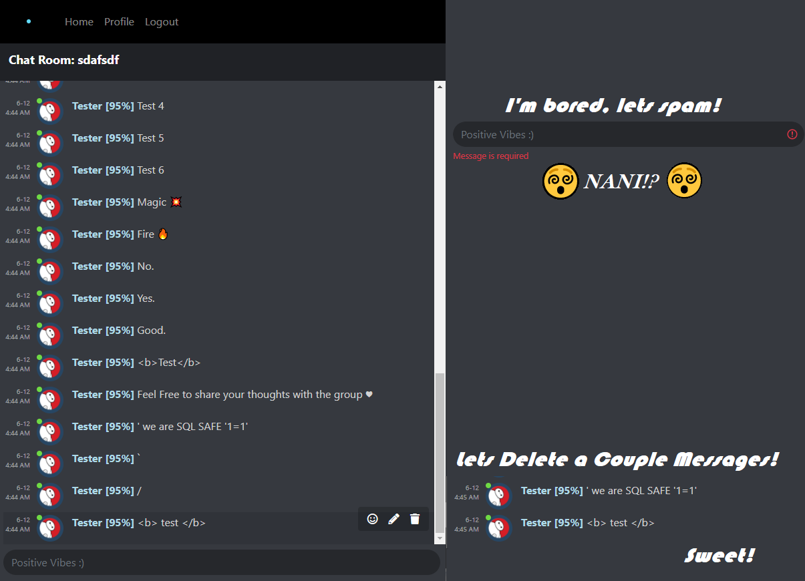
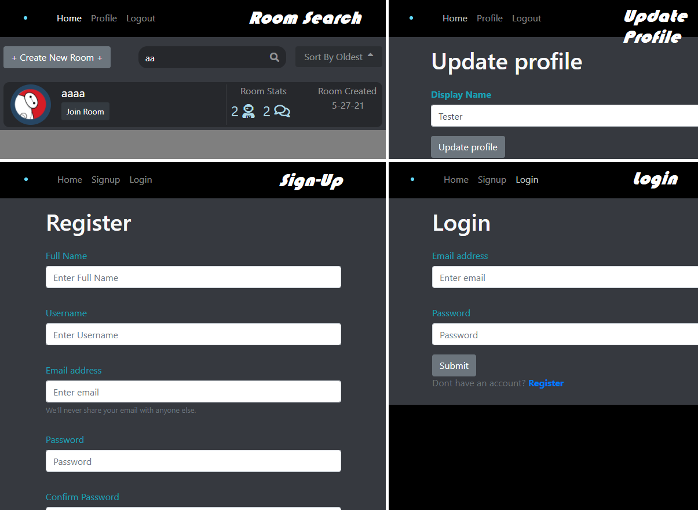

# Extended Chatroom Project

## Info

Design style inspired by Discord  

Sleek ChatRooms that use WebSockets (socket.io), allowing for lightning fast communication with anyone in the world!  

More features coming soon ✨

## Online Demo
***Want to take it for a spin? Let's Go!! 🚗*** 

**Server**  
https://chat-server-oa.herokuapp.com/  

**Client**  
http://chat-client-oa.herokuapp.com/  

*Feel free to use this test account  
email: test2@test.com  
pass: tester  

email: sir@edward.com
pass: siredward

email: harlem@globetrotters.com
pass: harlem

The heroku server disconnects after a long period of inactivity.  
So be sure to start the server first.  
The client takes a while to load initially after its server has gone offline.

-   https://chat-server-oa.herokuapp.com/api/room/list
-   https://chat-server-oa.herokuapp.com/api/room/messages/:roomID  
    -   *Left temporarily open (no athentication) for testing and api demo purposes*
    -   *Use the /room/list API to get a valid roomID*

## Local Usage Instructions
### Start Server

1. cd server
2. npm install
3. npm start

### Start Frontend (React)

1. cd client
2. npm install
3. npm start

### View Frontend

Navigate to: http://localhost:3000  
Ports can be customized in `client/constants` and `server/constants`  

Make sure you adjust the related port as they rely on each other

## Features:
#### Homepage
-   🔼🔽 Sort Chatrooms by creation date (Ascending, decending)
-   📊 Room stats: Participants, Messages, Creation Date
-   🔎 Search Rooms
-   🔨 Long room names will truncate with ellipses 
-   🎬 Static (for now) room image

#### Chatroom
-   😏 Emoticons are emojified, thats things like :) :D ;D etc etc
-   🔴 User online status is displayed with a green (online) or gray (offline) dot
-   📛 Entering an empty string informs the user to enter a message 
-   📜 Displays a history of messages (limited to 20, but limit is customizable through constants)
-   ⏬ Chat scrolls to bottom upon loading or recieving a new message
    -   In the bottom right, there is a small black dot when you click on it, it will scroll to the bottom ⚫
-   🎬 Hover over a message for additional actions
    🗑 As the author of a message, you can delete it (other actions are not yet supported). If youre not the author this isnt displayed.
    In the backend, the logged in user is also checked with the claimed author id to protect against forgery attacks
-   🔐 Socket Authentication Middleware
    Persists token and makes sure we are logged in when messaging
    
#### Profile
-   🙎‍♂️ You can update your Display Name

*TODO: Full profile buildout. The schema is already there to store a lot more information, such as favorite rooms, etc.*
    
#### Everywhere 🌎
-   Authentication 🔐
-   Data Validation+Sanitization 🧺 (via express-validator, socket based checking, and Formik)

#### Server
-  Api Routes
    -   Everything is serverd through <server>/api/
    -   All routes have been thoroughly tested via Postman
-   Sockets served via the default GET <server>/socket.io/
-   Everything else is blocked with a basic 404 Not Authorized Response

## Toolset
#### Frameworks
-   Node/Express, MongoDB via Mongoose, React

#### Server Packages
-   bcrypt              (password hashing)
-   cors                (since running a server/client setup, requests originate from a different port and will be blocked by browsers by default)
-   express-validator   (validate + sanitize requests)
-   morgan              (log server response codes and response time)
-   socket.io           ✨ Magic ✨ Also is the reason a seperate client/server are needed and made doing this 10-20x harder, easily. That said, I learned a lot.

#### Client Packages
*Note: There are several packages that I installed, played with, and removed but remain in the package.json such as emoji-mart*
-   axios                   (making web requests more easily)
-   bootstrap               
-   formik                  (More advanced form creation)
-   moment                  (Easily process/convert timestamps into readable formats)
-   react-emoji             (Converts emoticons into emoji's)
-   react-scroll-to-bottom  (Scroll an enclosed section to the bottom. Just as easy to do with useRef, which I was doing previously.)
-   yup                     (JS schema builder, mainly used in conjunction with formik)
-   socket.io-client        ✨ Magic ✨

## Changeable Configuration
Some of the settings you may wish to modify include the following

***/server/constants/default.json***
-   mongoURI: Make the project work on any mongo instance! Even a local one :)
-   **server_port**: the port the server runs on and listens for queries and socket data
-   **client_address**: array of clients allowed to make socket requests. If you change the client port, make sure you change this too.
-   **message_history_limit**: The number maximum number of messages that will be retrieved when entering a room
        Why would we want to limit this? Two reasons
        1) Imagine a chatroom with thousands of messages. Because of how it is configured to populate between different MongoDB collections (ChatMessage populates User data), internally it runs a seperate query for ***each** record in order to populate that data.
        2) Your users only have so much compute power. We want to keep our website fast and lag-free!
    -   Future plans include adding a "load more" at the top of chat rooms
-   JWT_SECRET: Please note, changing this will invalidate all your users, requiring them to sign up new accounts. 
    -   Future plans include a tool that wipes all users passwords and emails them with a secure link to create a new password
-   JWT_TOKEN_DURATION: How long (in seconds) a token lasts for, after which a user will be logged out. 

***/client/constants/default.json***
-   **SERVER_PORT**: Make sure you change this if you change the servers port.
Note: Do you want to run the client on a different port? React is configured to run on port 3000 by default (and will prompt you if its in use to automatically pick another)  
To specify a different port for the client: modify `/client/package.json` under scripts: start, change this to `"start": "PORT=3006 react-scripts start"` as an example to change it to port 3006
    
## Screenies
#### Homepage with list of Chatrooms

#### Inside a chatroom

#### Other pages

